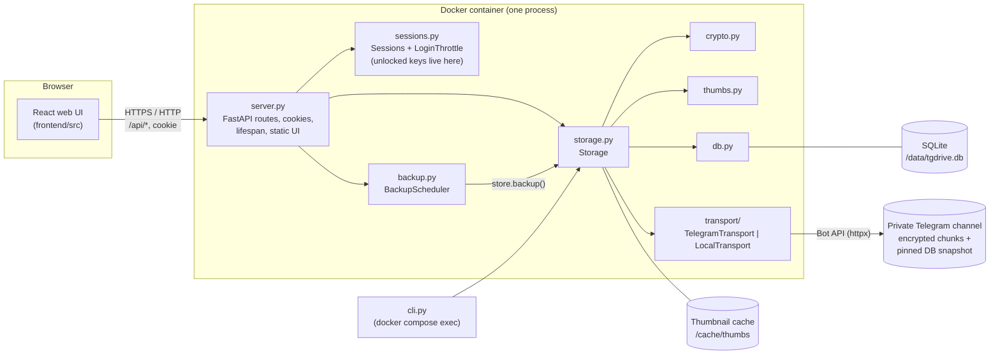
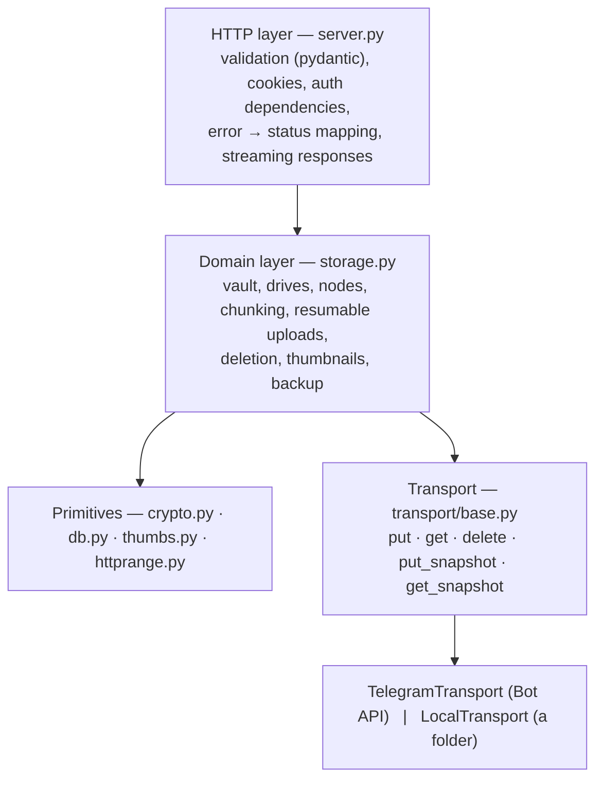
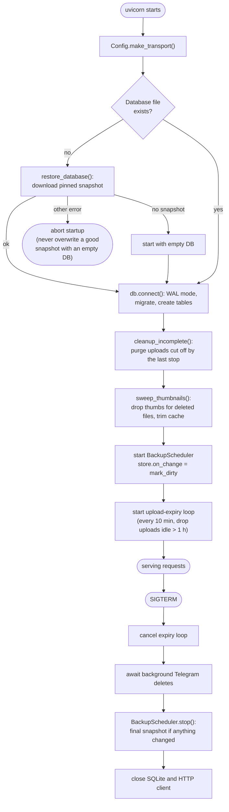
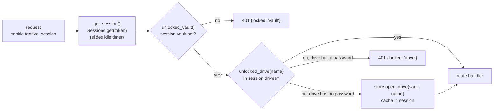
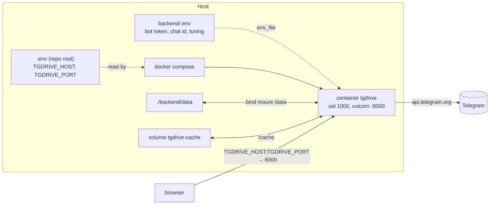

# Architecture

## Components

There are three places data lives:

| Where | What | Encrypted? |
|---|---|---|
| Telegram channel | One document message per file chunk, plus one pinned database snapshot | Chunks always. The snapshot only if `TGDRIVE_BACKUP_PASSPHRASE` is set (its keys and names are encrypted either way) |
| SQLite (`/data`) | Vault, drives, folder tree, chunk map | Names and keys yes; sizes, dates, drive names and tree shape no |
| Thumbnail cache (`/cache`) | One 320px WebP per file | Yes, with the file's own key |

And one place keys live: the server's memory, inside a `Session`.

## Layers

The backend is layered so each layer only knows about the one below it:

- `server.py` never touches SQL or crypto directly (apart from comparing the
  admin password and catching `BadKey`). It turns HTTP into `Storage` calls.
- `storage.py` never knows about HTTP, cookies or Telegram. It talks to an
  abstract `Transport`, so tests and offline development swap in
  `LocalTransport` with `TGDRIVE_TRANSPORT=local`.
- `cli.py` is a second front end over the same `Storage` class.

## Process model: exactly one worker

The Dockerfile runs `uvicorn --workers 1`, and this is a hard requirement:

- Unlocked vault and drive keys are in `app.state.sessions`, the one
  session every device shares. A second worker would not see them.
- The upload line every device shares (`app.state.uploads`) is in memory.
- In-progress resumable uploads (`Storage._uploads`) are in memory.
- There is one SQLite connection, used only from the event loop thread.

Concurrency inside that one process comes from asyncio. CPU-heavy work is
pushed to worker threads with `asyncio.to_thread`:

| Work | Where it runs | Limit |
|---|---|---|
| Argon2id (password checks) | thread | 2 at once (`_kdf_gate`); each run uses 64 MiB |
| Chunk encrypt/decrypt | thread | one per active upload/download |
| Thumbnail generation (Pillow) | thread | 2 server-made at once (`_thumb_gate`) |
| All SQLite access | event loop thread | — |

## Startup and shutdown

`server.lifespan()` runs once when uvicorn starts and once when it stops.

Because every unlocked key is in memory, **any restart locks everything**.
The Compose file gives the container 60 s (`stop_grace_period`) to upload the
final snapshot.

## Request handling

Each API route declares what it needs with FastAPI dependencies:

The UI reads the `locked` field to decide whether to show the master
password screen or a drive's unlock dialog.

Exceptions from `storage.py` are mapped to status codes in one place,
`create_app()`:

| Exception | Status | Meaning |
|---|---|---|
| `NotFound` | 404 | No such drive, node or upload |
| `Conflict`, `NoVault` | 409 | Name taken; already set up; not set up; resume offset ahead of what is stored |
| `Gone` | 410 | Upload cancelled or expired while being written |
| `TransportUnavailable` | 503 | Telegram gave up after its retries; what was stored is kept |
| `StorageError`, `BadImage` | 400 | Anything else the caller did wrong |
| `Locked` | 401 | Body says `"locked": "vault"` or `"drive"` |
| `crypto.BadKey` (outside a password check) | 500 | Stored data failed its integrity check |

Password checks go through `_throttled()`, which turns `BadKey` into a 401
and applies the per-client backoff (see [sessions.py](backend.md#sessionspy)).

## Serving the web UI

When `TGDRIVE_STATIC_DIR` is set (it is in the Docker image), `server.py`
also serves the built frontend:

- `/assets/*` (Vite output with content hashes) is cached for a year as
  `immutable`.
- Any other non-`/api` path returns `index.html`, so client-side routes such
  as `/d/Photos/<folder-id>` survive a reload.
- `index.html` is sent with a strict Content-Security-Policy: scripts only
  from the same origin, no inline script, `blob:` allowed only for images
  and media (decrypted thumbnails and previews), `frame-ancestors 'none'`.

In development, Vite serves the UI on port 5173 and proxies `/api` to
FastAPI on 8000, so cookies stay same-origin.

## Deployment

The [Dockerfile](../Dockerfile) has two stages: `node:22-alpine` runs
`npm ci && npm run build`, and `python:3.12-slim` installs the backend and
copies the built UI to `/app/static`. The container runs as uid 1000 so the
bind-mounted `backend/data` stays writable from the host. A health check
calls `GET /api/health` every 30 s.
