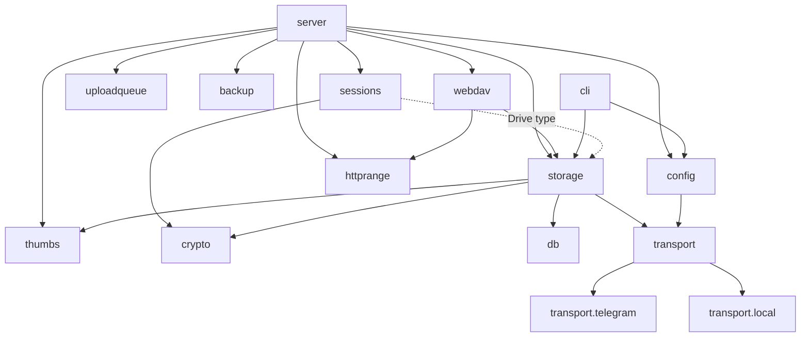
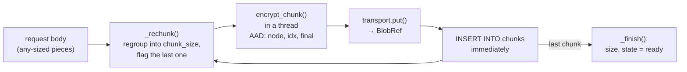
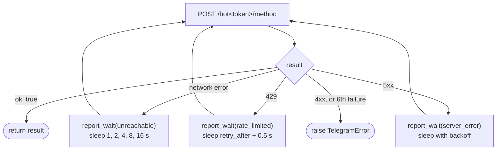
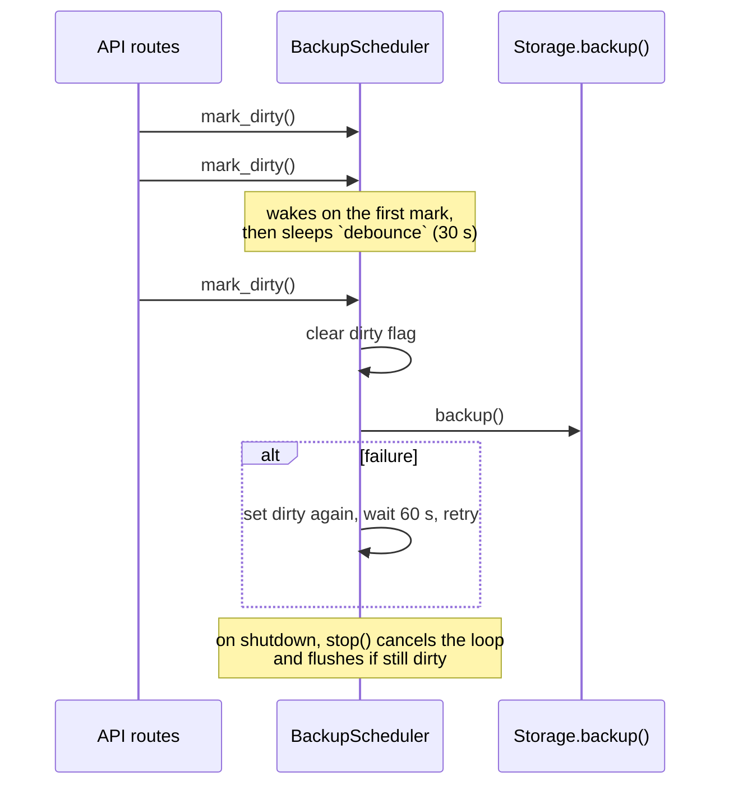

# Backend modules

Python 3.12, in [backend/app](../backend/app). Dependencies: FastAPI and
uvicorn (HTTP), httpx (Telegram), cryptography, Pillow (thumbnails),
python-dotenv.



- [config.py](#configpy)
- [crypto.py](#cryptopy)
- [db.py](#dbpy)
- [storage.py](#storagepy)
- [transport/](#transport)
- [sessions.py](#sessionspy)
- [uploadqueue.py](#uploadqueuepy)
- [backup.py](#backuppy)
- [thumbs.py](#thumbspy)
- [httprange.py](#httprangepy)
- [server.py](#serverpy)
- [webdav.py](#webdavpy)
- [cli.py](#clipy)
- [tests/](#tests)

---

## config.py

Reads environment variables (and `backend/.env` through python-dotenv) into
a `Config` dataclass. The full list with defaults is in the
[README's settings table](../README.md#settings).

`Config.make_transport()` picks the storage backend: `LocalTransport` when
`TGDRIVE_TRANSPORT=local`, otherwise `TelegramTransport`, exiting if the bot
token or chat id is missing.

---

## crypto.py

The key hierarchy and every encrypt/decrypt operation. Pure functions with
no I/O, so they are safe to run in worker threads. Explained in full in
[crypto.md](crypto.md).

| Group | Functions / classes |
|---|---|
| Internals | `_seal`/`_open` (AES-GCM with AAD), `_kdf` (Argon2id), `_hkdf` |
| Vault | `new_vault_key`, `wrap_vault_with_password`, `unwrap_vault_with_password`, `wrap_vault_with_recovery`, `unwrap_vault_with_recovery` |
| `VaultKeys` | An unlocked vault. Derives the open-drive key and binding key; `wrap_open`/`unwrap_open`, `bind` |
| Drive master key | `new_master_key`, `wrap_with_password`, `unwrap_with_password` (vault-bound, or legacy without a vault), `wrap_with_recovery`, `unwrap_with_recovery` |
| `DriveKeys` | An unlocked drive. `new_file_key`, `unwrap_file_key`, `encrypt_name`, `decrypt_name` |
| Data | `encrypt_chunk`/`decrypt_chunk`, `encrypt_thumbnail`/`decrypt_thumbnail` |
| Snapshot | `seal_snapshot`/`open_snapshot` (`TGD1` plain or `TGD2` passphrase-encrypted) |

`BadKey` is the one error: wrong password or key, or modified ciphertext.

---

## db.py

- `connect(path)`: opens SQLite with WAL, runs `_migrate`, enables foreign
  keys, creates tables if missing. `check_same_thread=False` is set, but the
  connection is in practice used only from the event loop thread.
- `_migrate(conn)`: upgrades a pre-vault `drives` table (see
  [data-model.md](data-model.md#notes-on-the-tables)).
- `snapshot(conn)`: `VACUUM INTO` a temporary file (a consistent, compacted
  copy taken while the database stays live) and gzips it.
- `restore(path, bytes, overwrite)`: un-gzips a snapshot to `path`, removing
  stale `-wal`/`-shm` files. Refuses to overwrite unless asked.

---

## storage.py

The core of tgdrive. One `Storage` instance owns the SQLite connection, the
transport and the thumbnail cache. It knows nothing about HTTP.

### Types

| Name | What |
|---|---|
| `Drive` | An unlocked drive: id, name, `DriveKeys`, `protected`. Holding one is what "unlocked" means |
| `DriveSummary` | Name and whether it has a password |
| `Entry` | A file or folder as shown to users: id, kind, decrypted name, size, created_at, has-thumbnail |
| `UploadState` | Progress of one resumable upload (see below) |
| Errors | `StorageError` and its subclasses `NotFound`, `Conflict`, `NoSnapshot`, `NoVault`, `TransportUnavailable`, `Gone` |

### Vault and drives

| Method | Does |
|---|---|
| `setup_vault(password)` | First run. Creates the vault key, wraps it twice, returns `VaultKeys` and the recovery key |
| `unlock_vault(password)` / `unlock_vault_with_recovery(key)` | Unwraps the vault key |
| `set_vault_password(vault, new)` | Re-wraps the vault key only |
| `create_drive(vault, name, password)` | New random master key, wrapped in `open` or `password` mode. Returns the drive and, for password drives, its recovery key |
| `open_drive(vault, name)` | Opens an `open` drive with the vault |
| `unlock(vault, name, password)` | Opens a password drive; upgrades `legacy` drives |
| `unlock_with_recovery(name, key)` | Opens a drive with its recovery key |
| `set_password(vault, drive, new or None)` | Adds, changes or removes a drive password by re-wrapping the master key. Creates a recovery key the first time a drive gets a password |
| `rename_drive`, `detach_drive`, `delete_drive` | Rename is a label change only: every key is bound to the drive's id, not its name |
| `enable_webdav(drive, read_only)` | Wraps the master key under a new random WebDAV password (replacing any old one) and returns it, once |
| `webdav_access(name)`, `disable_webdav(name)` | Whether WebDAV is on, and how; turning it off needs no key |
| `open_webdav(name, password)` | Opens the drive with its WebDAV password alone; returns the drive and whether it is read-only |

Argon2id calls go through `_kdf()`, which runs them in a thread under a
semaphore of 2.

### Folder tree

`list`, `stat`, `find`, `path` (breadcrumbs), `mkdir` (with `exist_ok` for
folder uploads), `rename`, `move`, `move_many` (all-or-nothing, and refuses
to move a folder into itself), and `search`.

`search(drive, query)` splits the query into words, decrypts every name in
the drive, keeps names containing every word (case-insensitive), and ranks
them: exact name or name-without-extension first, then names starting with
the first word, then the rest; folders before files. It returns up to
`limit` results with their folder path, plus the total match count.

### Uploading: the chunk pipeline



Data streams straight through: a file is never held in full or written to
disk. Memory use per upload is about one chunk.

There are two ways in:

- **`upload(drive, parent, name, source)`**: one shot. Used by
  `PUT /files` and the CLI. If anything fails, the partial file is purged.
- **Resumable**, used by the web UI:
  - `start_upload(drive, parent, name, size, modified)` inserts the node in
    state `uploading` (reserving the name) and an `UploadState` in memory.
  - `find_upload(drive, parent, name, size, modified)` finds an unfinished
    upload of the same file, so `POST /uploads` hands it back (with its
    `stored`) instead of refusing the name. `modified` is the browser's
    `File.lastModified`; without it nothing is matched.
  - `unfinished_uploads(drive)` backs `GET /uploads`, which the UI uses to
    show uploads a closed tab left behind, to resume or discard.
  - `write_upload(drive, id, offset, source)` accepts the file from any
    `offset` up to `state.stored`. Bytes the server already has are skipped.
    Whole chunks are stored as they fill (`_flush_upload`); a partial chunk
    left when the body ends is dropped, to be sent again. It returns `True`
    once the last chunk is stored. At most one chunk is ever sent twice.
  - `upload_state()`, `cancel_upload()`, and `expire_uploads(idle)`.

`UploadState` fields that the UI shows:

| Field | Meaning |
|---|---|
| `stored` | Bytes safely in Telegram. The resume point |
| `phase` | `idle`, `receiving` (reading from the client), `storing` (sending to Telegram), `waiting` (Telegram asked us to wait) |
| `wait` | When waiting: reason (`rate_limited`, `unreachable`, `server_error`), attempt, attempts, seconds left |

The `wait` value is filled in without passing anything through the
transport: `write_upload` sets the `on_wait` context variable to
`state.waiting`, and the transport reports each retry to whatever listener
the context holds (see [transport/base.py](#transportbasepy)).

Each `UploadState` has an `asyncio.Lock`. A reconnecting client waits until
a dropped connection's handler has finished its chunk, so two writers never
interleave. `gone` is set when the upload is cancelled or its node deleted,
so a writer still running stops with `Gone` (410).

If storing a chunk fails after the transport's own retries, `write_upload`
raises `TransportUnavailable` (503). What was stored stays, and the client
can resume later.

### Downloading

`download(drive, id, start, end)` is an async generator over plaintext
bytes `[start, end)`. It verifies the chunk map is complete, fetches only
the chunks overlapping the range, decrypts each in a thread, and slices
it. This is what makes video seeking cheap: a `Range` request near the end
of a 4 GB video fetches one 16 MiB chunk.

Chunks go through `_get_blob()`, which keeps recently read blobs in memory,
**still encrypted**, up to `TGDRIVE_CHUNK_CACHE_MB` (64 by default; `0`
turns it off), evicting the least recently used. Readers that make many
small range requests into one chunk (a comic's pages, a zip's index, a
video player seeking about) fetch it from Telegram once. Requests for a
blob already being fetched wait on that fetch (shielded, so one client
going away doesn't cancel it for the others). Deleted files' blobs are
dropped from it in `discard()`.

### Deleting

`delete_nodes()` and `detach_drive()` call `_detach()`, which in one
transaction walks each subtree with a recursive CTE, collects its chunk
references, and deletes the top rows (children go by `ON DELETE CASCADE`).
Then thumbnails are removed and any in-flight upload under it is marked
`gone`. The references are returned so the caller can delete the Telegram
messages; `discard()` does so with `delete_many()` and logs, never raises,
on failure.

### Thumbnails

| Method | Does |
|---|---|
| `set_thumbnail(drive, id, image)` | Re-encodes any image to a 320px WebP (`thumbs.make`, in a thread), seals it with the file key, writes it atomically, then trims the cache |
| `thumbnail(drive, id)` | Returns the decrypted WebP. If there is none and the file is an image of a known type up to 50 MB, downloads it once and makes one. A per-node lock stops two requests making the same thumbnail; failures are remembered in `_thumb_failed` |
| `sweep_thumbnails()` | At startup: deletes thumbnails whose node no longer exists (after a restore) and leftover `.tmp` files |

### File details

| Method | Does |
|---|---|
| `info(drive, id)` | The file's details (`width`, `height`, `duration`, `modified`, `taken`, `camera`; any may be missing), decrypted from `nodes.info_enc` |
| `set_info(drive, id, fields)` | Merges `fields` in, seals the JSON with the file key (AAD `tgdrive/info\|<id>`) and saves it |

Details are never worth fetching a file from Telegram for. Browsers send
them from the local copy after an upload and from previews they are already
showing (`PUT /files/{id}/info`); `thumbnail()`, which has the whole image
in hand anyway, adds an image's own with `thumbs.describe`.

Thumbnails are kept on local disk rather than in Telegram because one extra
channel message per file would halve upload speed under Telegram's per-chat
rate limit.

### Backup and restore

- `backup()`: `db.snapshot` → `crypto.seal_snapshot` →
  `transport.put_snapshot`. Fails if the snapshot is larger than one blob
  (20 MB).
- `restore_database(transport, path, passphrase, overwrite)`: the reverse,
  as a module function since there is no `Storage` yet when it runs.

---

## transport/

### transport/base.py

The interface every backend implements:

```python
class Transport(ABC):
    max_blob_size: int
    async def put(data: bytes) -> BlobRef
    async def get(ref: BlobRef) -> bytes
    async def delete(ref: BlobRef) -> None
    async def delete_many(refs: list[BlobRef]) -> None   # default: loop over delete
    async def put_snapshot(data: bytes) -> None
    async def get_snapshot() -> bytes | None
    async def close() -> None
```

- `BlobRef(chat_id, message_id, file_id)`: where a blob lives.
- `Wait(reason, seconds, attempt, attempts)`: a retry about to happen.
- `on_wait`: a `ContextVar` holding a callback. `report_wait(wait)` calls
  it if set. Because context variables follow the asyncio task, the
  transport can report retries to the upload that caused them without
  either side knowing about the other.

### transport/telegram.py

Talks to the cloud Bot API with one `httpx.AsyncClient`. The bot can upload
50 MB but download only 20 MB, so `max_blob_size` is 20,000,000 bytes, and
`Storage` refuses a `chunk_size` that would not fit with its 28 bytes of
overhead.

| Operation | Bot API calls |
|---|---|
| `put` | `sendDocument` with a random `<32 hex>.bin` name, no notification, content-type detection off |
| `get` | `getFile` then download by `file_id`. If that fails (for example the bot token was replaced, so old `file_id`s are invalid), `forwardMessage` the original to get a fresh `file_id`, delete the forward, and download again |
| `delete` | `deleteMessage` |
| `delete_many` | `deleteMessages`, 100 ids per call; failures are logged |
| `put_snapshot` | Send with caption `tgdrive-snapshot`, `pinChatMessage`, then delete the previously pinned snapshot |
| `get_snapshot` | `getChat` → the pinned message, if its caption is `tgdrive-snapshot` → download |

`_call()` retries every API call up to 6 times:



### transport/local.py

Stores each blob as `<n>.bin` in a folder, with increasing numbers as
message ids, and the snapshot as `snapshot`. Used by the tests and by
`TGDRIVE_TRANSPORT=local` for development without Telegram. Same 20 MB
limit as Telegram, so behaviour matches.

---

## sessions.py

- **`Session`**: `vault` (`VaultKeys` or None), `drives` (name → unlocked
  `Drive`), `last_seen`.
- **`Sessions`**: there is one `Session`, shared by every device. Each
  device that logs in gets its own 32-byte URL-safe token from `create()`,
  which joins the live session or starts one. `get(token)` returns `None`
  for an unknown token, and ends the session for everyone once it has been
  idle longer than `idle_seconds`; otherwise it slides the timer forward.
  `end()` logs every device out. `forget_drive(name)` re-locks a drive
  (used after its password changes or it is deleted); `rename_drive`
  follows a rename.
- **`LoginThrottle`**: per `(scope, client IP)` counter. Five free wrong
  tries, then the wait doubles from 1 s up to a 60 s cap. A success clears
  the counter. Scope is `"vault"` or a drive name.

Clocks are injectable, so the tests fake time.

---

## uploadqueue.py

**`UploadQueue`**: the upload line every browser tab shares, so only one
file is sent at a time across all devices, and every device shows the
same list. It holds no file data: each tab still sends its own files.

- `sync(client, items, removed, cancel, epoch, since)`: a tab (`client`,
  a random id per tab) reports the rows that changed since its last sync
  and the ids it dismissed, and may ask other tabs to stop rows (`cancel`,
  by key `"<client>:<id>"`). It gets back the rows changed since revision
  `since`, and the order of the whole line if that changed. A tab starts
  its next file only when nothing ahead of it is still going.
- New rows join the back of the line; a retried row goes to the back
  again. A row that is already sending when its tab (re)appears keeps its
  turn ahead of rows still waiting.
- A tab that has not synced for `idle_seconds` (60) leaves the line, and so
  does one that calls `leave()` (sent on `pagehide`). What it had started
  stays an unfinished upload on the server, ready to resume.
- `epoch` changes on every restart; with `resend`, the server asks a tab
  to report all of its rows again.

---

## backup.py

`BackupScheduler` batches many changes into one snapshot upload.



Routes call `_changed(request)` (which is `mark_dirty`) after anything that
alters the database: setup, password changes, drive create/rename/delete,
folder and node changes, completed uploads.

---

## thumbs.py

`make(data)` turns untrusted image bytes into a thumbnail:

1. Open with Pillow; accept only JPEG, MPO, PNG, GIF, WebP, BMP, AVIF.
2. Refuse anything over 64 megapixels before decoding.
3. Decode JPEGs at reduced scale (`draft`), apply EXIF rotation, scale to
   fit 320 × 320.
4. Save as WebP, quality 75.

Any failure raises `BadImage`. `can_generate(name, size)` says whether the
server will make one itself (known image extension, at most 50 MB).
`UPLOAD_MAX` caps browser-sent thumbnails at 4 MB.

`describe(data)` reads an image's headers only: its shown width and height
(EXIF rotation applied), and the EXIF date taken and camera, if present.
It returns `{}` for anything that isn't a readable image.

---

## httprange.py

`parse_range(header, size)` handles a single `bytes=` range:
`start-end`, `start-` and `-suffix`. It returns `(start, end_exclusive)`,
`None` for "send the whole file" (missing, malformed or multi-range
headers, as the spec allows), or raises `RangeNotSatisfiable` (the server
answers 416).

---

## server.py

The FastAPI application. Sections in the file:

1. **Request bodies**: pydantic models. Drive names are 1–64 characters,
   `^[A-Za-z0-9][A-Za-z0-9 _.-]*$`; new passwords are at least 8 characters.
2. **Dependencies**: `get_store`, `get_session`, `unlocked_vault`,
   `unlocked_drive` (see [architecture.md](architecture.md#request-handling)),
   `_session_for` (creates the session and sets the cookie on first
   unlock), `_throttled` (password check with backoff), `_changed` (mark
   for backup), `_discard_later` (delete Telegram messages in a background
   task tracked in `app.state.discards`).
3. **Routes**, all under `/api`. The full list is in the
   [README](../README.md#http-api) and live at `/api/docs`.
4. **Web UI** serving and its Content-Security-Policy.
5. **`lifespan`** (startup/shutdown, see
   [architecture.md](architecture.md#startup-and-shutdown)) and
   **`create_app`** (routes, UI, exception → status mapping).

Two route details worth knowing:

- `download_file` pulls the first piece of the stream **before** returning
  the `StreamingResponse`. A missing chunk or failed integrity check then
  becomes a proper error response, instead of a `200` that is cut off
  half-way.
- `delete_node`, `delete_nodes` and `delete_drive` answer as soon as the
  rows are gone; message deletion continues in the background and shutdown
  waits for it.

---

## webdav.py

WebDAV at `/dav/<drive>/` (outside `/api`), for mounting a drive as a
network drive. An `APIRouter` included before the web UI's catch-all route.

- **Sign-in**: HTTP Basic, any user name, the drive's WebDAV password,
  checked by `Storage.open_webdav()` on every request (an HKDF and one
  AES-GCM open, so no session is kept). Wrong passwords go through the
  same `LoginThrottle` as the web UI, keyed by drive and client IP. A
  missing drive, WebDAV being off and a wrong password all answer the same
  401. `OPTIONS` is answered without signing in, as clients probe first.
- **Paths** are walked a segment at a time with `Storage.find()`, which
  decrypts each folder's names; there are no ids in WebDAV URLs.
- **Methods**: `PROPFIND` (depth 0 or 1; `infinity` is answered as 1, and
  every property is always sent), `GET`/`HEAD` with `Range`, `PUT`,
  `DELETE`, `MKCOL`, `COPY`, `MOVE`, plus `LOCK`/`UNLOCK`, which Finder
  and Windows need before they will write. Locks are granted but not
  enforced. `PROPPATCH` answers 207 and stores nothing. A read-only
  password gets 403 for every method that writes.
- **Replacing a file** (`PUT` over an existing name) uploads the new copy
  under a temporary name (uploads in progress aren't listed), then deletes
  the old node and renames the new one with no `await` in between, so
  other requests never see the name missing or doubled.
- **`MOVE`** uses `Storage.relocate()`, which moves and renames in one
  update. **`COPY`** re-uploads: each file has its own key, so chunks
  can't be shared.
- **Files are always attachments**, with `Content-Security-Policy:
  sandbox`, so nothing stored can run script on this origin. A folder
  `GET` returns a plain HTML listing for browsers, sandboxed the same way.

---

## cli.py

`python -m app.cli <command>` works on the same database and transport as
the server, without HTTP. It unlocks the vault with `TGDRIVE_MASTER_PASSWORD`
or a prompt, opens drives the same way the server does, and uploads a
snapshot after every change (there is no scheduler in a short-lived
process). Commands are listed in the
[README](../README.md#command-line-interface). `restore` is handled before
the database is opened, since it creates it.

---

## tests/

`python -m unittest discover -s tests -t . -v` from `backend/`. Everything
runs against `LocalTransport` in a temporary folder.

| File | Covers |
|---|---|
| `test_core.py` | Crypto round trips and tamper detection, chunking, upload/download, ranges, the chunk cache, snapshot and restore |
| `test_vault.py` | Vault setup, unlock and recovery; open vs password drives; legacy drive migration; bulk move/delete; Telegram `deleteMessages` batching (with a fake); thumbnail encoding; search ranking |
| `test_services.py` | `Storage` API surface, resumable uploads (including a flaky transport), the shared `Sessions` and its idle expiry, `UploadQueue`, `LoginThrottle`, Range parsing, `BackupScheduler` |
| `test_webdav.py` | WebDAV end to end: turning it on and off, new passwords, sign-in and throttling, files and folders (PUT, overwrite, ranges, COPY, MOVE, DELETE), locks, PROPPATCH, read-only access and its binding to the key |
| `test_api.py` | The HTTP API end to end with FastAPI's `TestClient`: files and folders, locking, cookies and errors, drive passwords, rename, resumable upload, thumbnails, search, admin-password setup, static UI serving |
