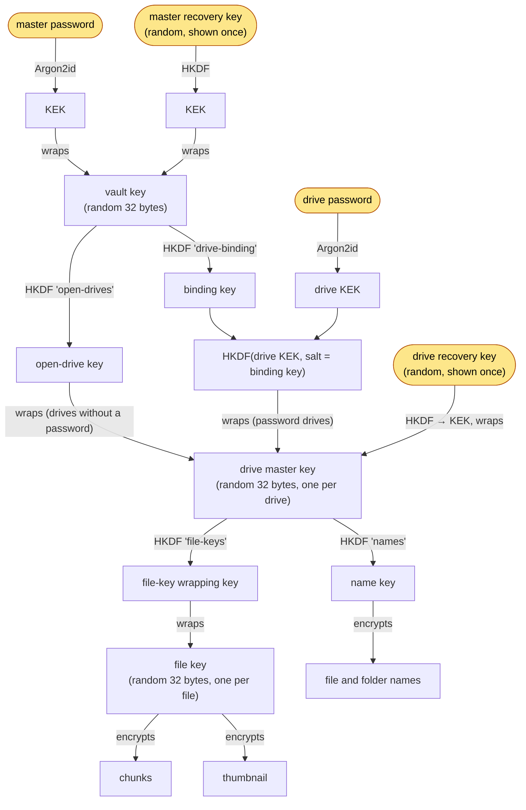

# Encryption and keys

All cryptography is in [backend/app/crypto.py](../backend/app/crypto.py),
built on the `cryptography` package:

| Primitive | Used for |
|---|---|
| **Argon2id** (t=3, m=64 MiB, p=4, 16-byte salt) | Turning a password into a key-encryption key (KEK) |
| **HKDF-SHA256** | Deriving subkeys from a key, and turning a random recovery key into a KEK |
| **AES-256-GCM** (12-byte random nonce, 16-byte tag) | Every encryption: wrapped keys, names, chunks, thumbnails, snapshots |

Every sealed blob is `nonce ‖ ciphertext ‖ tag`, so it is 28 bytes larger
than its plaintext (`CHUNK_OVERHEAD`). Argon2 parameters are stored with
each wrapped key, so they can be raised later without breaking old data.

## The key hierarchy



Rounded nodes are secrets that are never stored anywhere: the user holds
them. Everything else is either random and stored only in wrapped form, or
derived on the fly.

### What each design choice buys

- **Two levels of wrapping (password → master key → file keys).** Changing a
  password re-wraps one 32-byte key. Nothing in Telegram is re-encrypted, so
  it is instant regardless of how much a drive holds.
- **A drive password is bound to the vault.** A password drive's KEK is
  `HKDF(Argon2id(drive password), salt = binding key)`. The binding key comes
  from the vault key, so the drive password alone opens nothing, even for
  someone with a copy of the database. Both passwords are needed (or the
  master password plus the drive's recovery key).
- **Drives without a password** have their master key wrapped by the
  open-drive key, so they open as soon as the vault is unlocked.
- **Recovery keys** are 32 random bytes shown once in Base32 groups of four
  (`ABCD-EFGH-...`). They wrap the same key the password wraps, so resetting
  a forgotten password with one is just another re-wrap.
- **A per-file random key** means no two files share a key, and a file's key
  also protects its thumbnail.

### Legacy drives

Databases made before the vault existed have drives in mode `legacy`: the
master key is wrapped by the drive password alone. On the first successful
unlock, `Storage.unlock()` re-wraps it the new, vault-bound way and sets
mode `password`, then calls `on_change` so the change is backed up.

## Associated data: binding ciphertext to its place

Every AES-GCM seal carries associated data (AAD) naming what the blob is and
whose it is. Decrypting with the wrong AAD fails, so blobs cannot be moved
around without detection:

| Sealed thing | AAD |
|---|---|
| Vault key, under the password / recovery key | `tgdrive/vault-key/pw` · `tgdrive/vault-key/rk` |
| Drive master key | `tgdrive/drive-key/{open,bound,pw,rk}\|<drive id>` |
| File key | `tgdrive/file-key\|<node id>` |
| Name | `tgdrive/name\|<node id>` |
| Thumbnail | `tgdrive/thumbnail\|<node id>` |
| Chunk | `tgdrive/chunk\|<node id>\|<index: 8 bytes>\|<final: 1 byte>` |
| Snapshot | `tgdrive/snapshot` |

The chunk AAD matters most. Binding the node id, the position and a
"this is the last chunk" flag means Telegram (or anyone editing the channel)
cannot:

- swap a chunk from one file into another (node id),
- reorder chunks (index),
- cut a file short by dropping its tail (only the real last chunk has
  `final = 1`, and an empty file still gets one empty, final chunk).

Any such tampering makes decryption raise `BadKey`, which the API reports as
500 "stored data failed its integrity check" rather than serving wrong
bytes.

## Database snapshots

`seal_snapshot()` writes one of two formats:

```
TGD1 ‖ gzip(SQLite file)                                   no passphrase
TGD2 ‖ salt(16) ‖ AES-GCM(Argon2id(passphrase, salt), gzip(SQLite file))
```

Even an unencrypted `TGD1` snapshot holds only wrapped keys and encrypted
names. What it does reveal is drive names, file sizes, timestamps and the
shape of the folder tree. Setting `TGDRIVE_BACKUP_PASSPHRASE` hides those
from anyone who can read the channel.

## What each party can see

| Party | Sees | Cannot see |
|---|---|---|
| Telegram / the channel | Number and sizes of chunks, upload times; message file names are random (`<32 hex>.bin`) | File contents, file names, folder structure. With a backup passphrase: drive names and sizes too |
| Someone with a copy of `tgdrive.db` | Drive names, sizes, dates, folder shape, which messages belong to which file | Names, contents, any key. Opening a drive needs the master password (and the drive password for protected drives) |
| Someone with server memory (root on a running, unlocked server) | Keys of every unlocked session | Drives no session has unlocked |
| The browser | Decrypted names, files and thumbnails it is shown | Keys (they never leave the server) |

Note that encryption happens **on the server**, not in the browser. The
server sees plaintext while uploading and downloading; "end-to-end" here
means between your server and your storage, with Telegram as the untrusted
party. Run the server somewhere you trust, and put it behind HTTPS when you
reach it over a network.

## Other protections

- **Sessions**: a 32-byte random token in an `HttpOnly`, `SameSite=Strict`
  cookie (`Secure` when `TGDRIVE_COOKIE_SECURE=true`), one per device. All
  devices share one session, which expires after 30 minutes idle by
  default; logging out ends it everywhere.
- **Password guessing**: after 5 wrong tries from one client IP for one
  scope (the vault, or one drive), each further try must wait 1 s, 2 s,
  4 s, ... up to 60 s. Combined with Argon2id at 64 MiB, this makes online
  guessing slow.
- **First-run setup** can be locked with `TGDRIVE_ADMIN_PASSWORD`, compared
  in constant time.
- **Serving files**: only a short allow-list of types (PDF, plain text,
  common images, audio, video) is ever shown inline; everything else, HTML
  and SVG included, is sent as a download, so a stored file cannot run
  script on tgdrive's origin. All responses carry `X-Content-Type-Options:
  nosniff` and decrypted data is sent `Cache-Control: private, no-store`.
- **Thumbnails** are always decoded and re-encoded by Pillow, with a
  64-megapixel limit against decompression bombs, so what is stored and
  served is plain pixels with no metadata.
