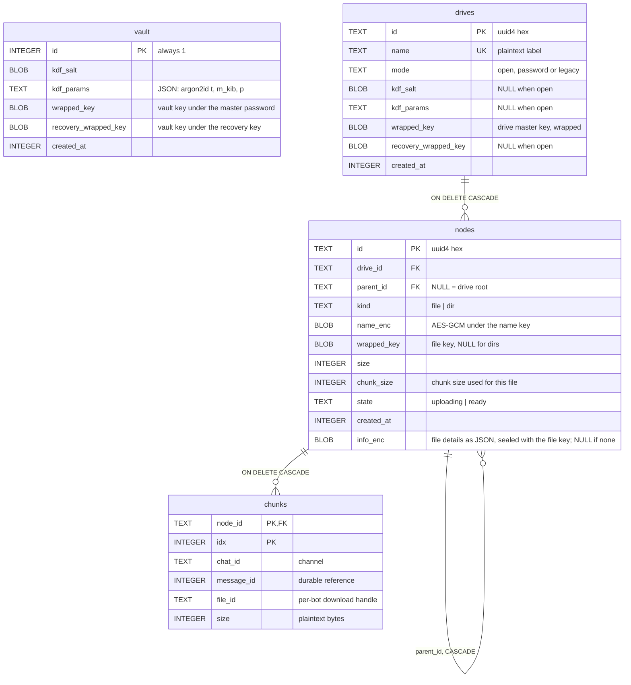
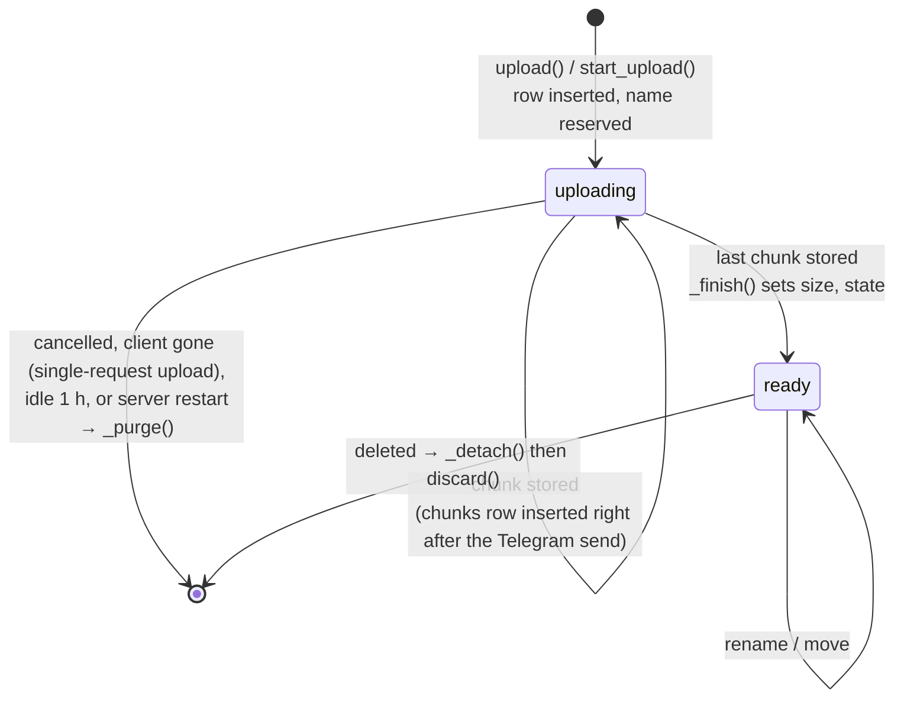

# Data model

The schema is in [backend/app/db.py](../backend/app/db.py). SQLite runs in
WAL mode with foreign keys on.

`vault` holds one row. Drives are not linked to it by a foreign key; the link
is cryptographic (see [crypto.md](crypto.md)).

## Notes on the tables

**`drives.mode`** decides how `wrapped_key` is opened:

| mode | `wrapped_key` is wrapped by | Recovery key? |
|---|---|---|
| `open` | the vault's open-drive key | no |
| `password` | drive password bound to the vault | yes |
| `legacy` | drive password alone (pre-vault databases) | yes; upgraded to `password` on next unlock |

`db._migrate()` converts a pre-vault `drives` table (no `mode` column) by
building `drives_new`, copying rows in as `legacy`, dropping the old table
and renaming. Foreign keys are switched off for this, or dropping the old
table would cascade into every node.

**`nodes`** is the folder tree for all drives. Both files and folders are
nodes. Names are encrypted, so the database cannot sort or search by name:
`Storage.list()` decrypts and sorts in Python (folders first, then by name),
and `Storage.search()` decrypts every name in the drive in memory. The index
`nodes_by_parent (drive_id, parent_id)` keeps folder listings fast.

Name uniqueness within a folder is enforced in Python
(`Storage._check_target`) by decrypting the folder's names, since equal
names encrypt to different ciphertexts. Nodes in state `uploading` count, so
two uploads cannot claim the same name.

**`chunks`** maps a file to its Telegram messages. Chunk `idx` holds
plaintext bytes `[idx * chunk_size, idx * chunk_size + size)`. `chunk_size`
is stored per file, so changing `TGDRIVE_CHUNK_SIZE` later does not break
existing files. `message_id` is the durable reference; `file_id` is a
download handle that belongs to the bot that received it, and is
re-obtained from the message if the bot is replaced.

A file of `n` bytes has `max(1, ceil(n / chunk_size))` chunks. `download()`
checks that the chunk indexes are exactly `0..count-1` before streaming.

## Node lifecycle

Only `ready` nodes are listed, searched, downloaded or given thumbnails.

### Crash safety

Two ordering rules keep the database and the channel consistent:

1. **When storing**, the Telegram message is sent first and the `chunks` row
   is written immediately after. A crash in between leaves at worst an
   orphaned, unreadable message in the channel, never a row pointing at
   nothing. On restart, `cleanup_incomplete()` purges every node still in
   `uploading`.
2. **When deleting**, `_detach()` removes the rows first (collecting the
   message references with a recursive CTE over the subtree) and the
   messages are deleted afterwards, in the background. A crash part-way
   leaves orphaned messages, not broken entries.

## In memory, not in the database

| State | Lives in | Lost on restart means |
|---|---|---|
| The session, the unlocked vault key, unlocked drives | `Sessions._session` | Everyone logs in again |
| The upload line every device shares | `UploadQueue` | Tabs report their uploads again (`resend`) |
| Resumable upload progress (`UploadState`) | `Storage._uploads` | The `uploading` node is purged; the browser starts that file again |
| Wrong-password counters | `LoginThrottle._fails` | Counters reset |
| "Thumbnail could not be made" set | `Storage._thumb_failed` | One more attempt per image |

## On disk, outside the database

The thumbnail cache, `TGDRIVE_CACHE_DIR/thumbs/<node id>.thumb`: each file is
the WebP thumbnail sealed with the file's key. File modification time is
used as "last shown" (updated on every read), and when the total passes
`TGDRIVE_THUMB_CACHE_MB` the least recently shown are deleted down to 90% of
the limit. The cache is disposable: images get theirs rebuilt on demand.
