# Request flows

Step by step, what happens for each main operation. "UI" is the browser,
"API" is `server.py`, "Storage" is `storage.py`, "TG" is the transport
(Telegram in production).

- [First-run setup](#first-run-setup)
- [Unlocking the vault and a drive](#unlocking-the-vault-and-a-drive)
- [Resumable upload](#resumable-upload)
- [Resuming after a dropped connection](#resuming-after-a-dropped-connection)
- [Telegram rate limits during an upload](#telegram-rate-limits-during-an-upload)
- [Download and video seeking](#download-and-video-seeking)
- [Deleting](#deleting)
- [Changing a password](#changing-a-password)
- [Thumbnails](#thumbnails)
- [Backup](#backup)
- [Restoring onto a new server](#restoring-onto-a-new-server)

---

## First-run setup

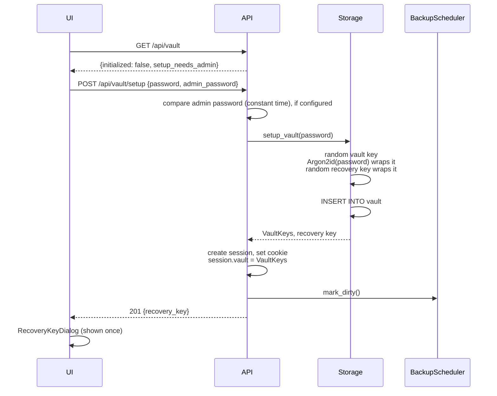

The recovery key is returned once and never stored. Only the wrapped vault
key is in the database.

## Unlocking the vault and a drive

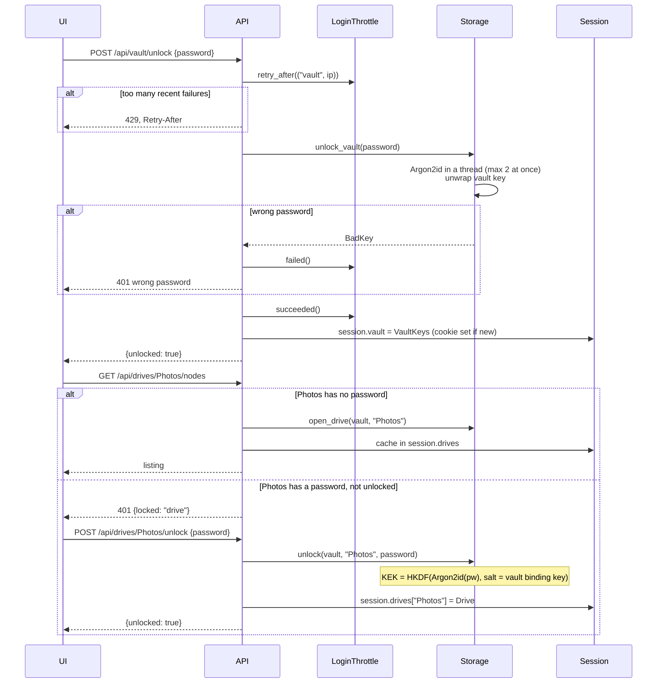

Every device that unlocks joins the same session, so they all see the same
unlocked drives. After 30 idle minutes (`TGDRIVE_SESSION_IDLE_MINUTES`)
without a request from any device the session is forgotten; the next request gets `401 {locked: "vault"}` and the UI returns
to the login screen.

## Resumable upload

The web UI always uses resumable uploads. A file of 40 MiB with 16 MiB
chunks becomes three chunks: 16 + 16 + 8.

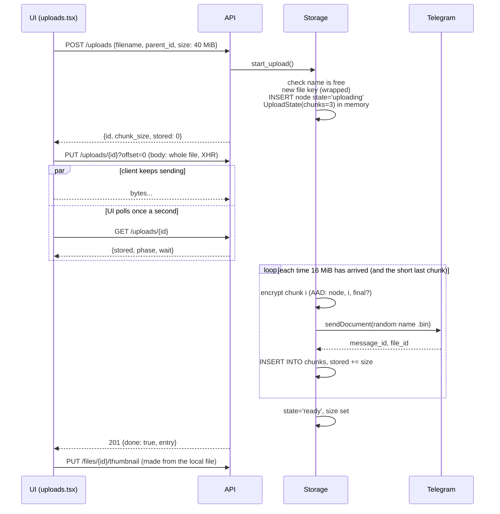

## Resuming after a dropped connection

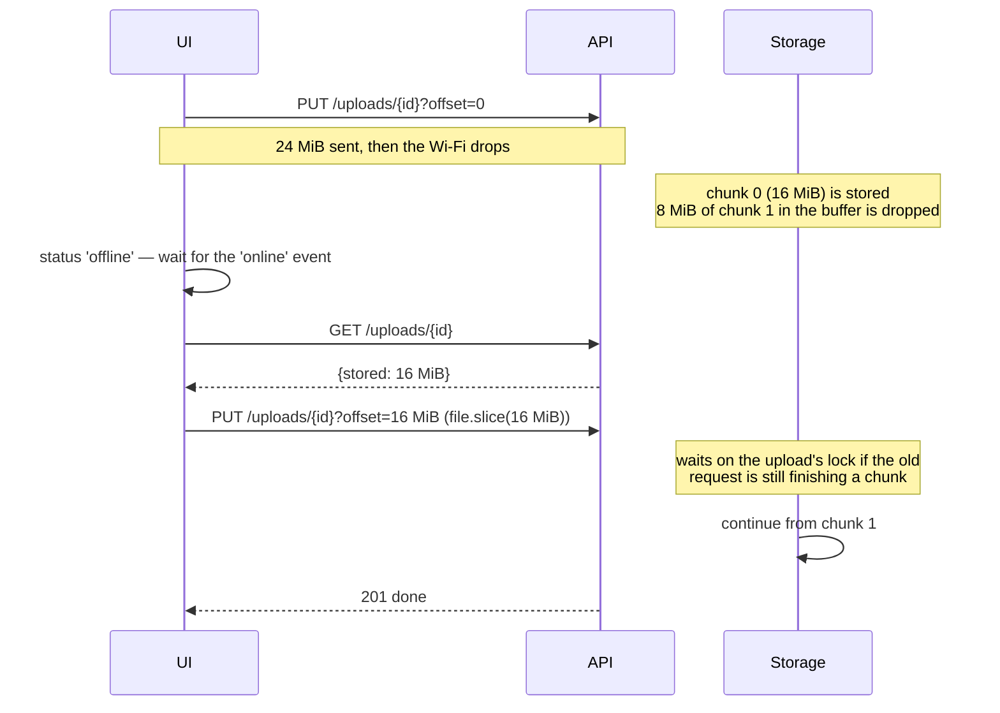

What happens in other cases:

| Situation | Server answer | UI does |
|---|---|---|
| Offset ahead of what is stored | 409 | Asks for status, resumes from `stored` |
| Offset behind what is stored | accepted | Server skips bytes it already has |
| Telegram gave up after 6 tries | 503 | Backs off (2 s … 30 s), resumes |
| Upload idle for an hour, or server restarted | 404 on status | Starts that file again from 0 |
| User cancels | — | Aborts XHR, `DELETE /uploads/{id}`; server purges stored chunks |
| More than 8 tries in a row without progress | — | Shows the error with Retry and Discard |
| Tab closed or reloaded mid-upload | `GET /uploads` lists it when the drive is next opened | Shows it as unfinished: choose the file again to resume, or discard it |
| The same file is uploaded again into the same folder | `POST /uploads` returns the unfinished upload's id and `stored` | Resumes from `stored` instead of failing with "already exists" |

## Telegram rate limits during an upload

Telegram limits how fast a bot can post to one chat. When it answers 429,
the transport waits and the UI explains why:

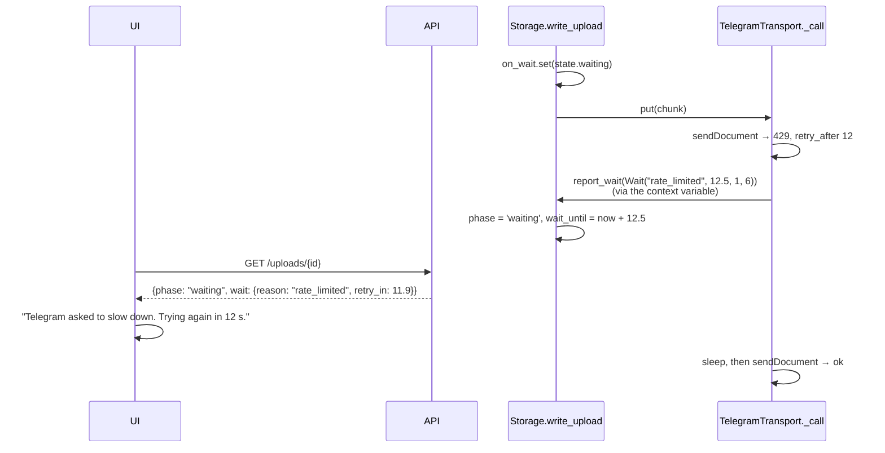

## Download and video seeking

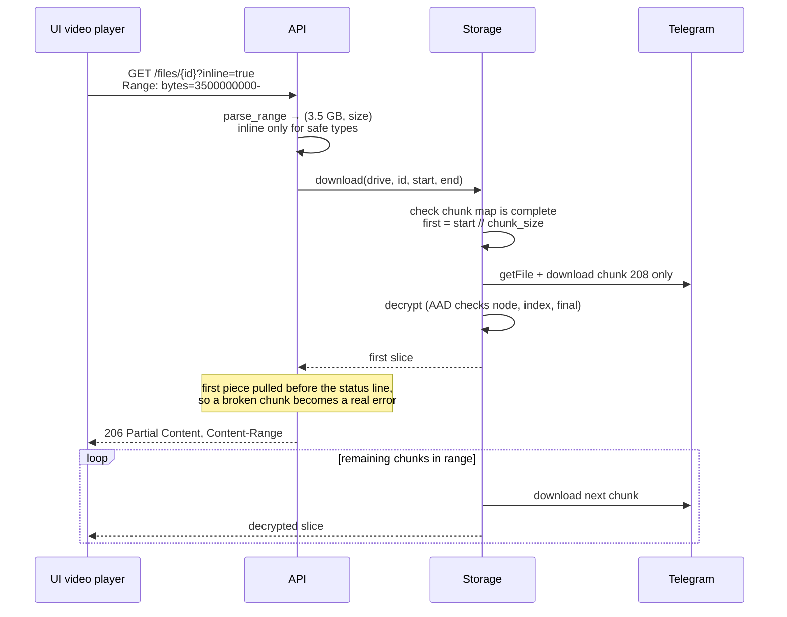

Only chunks overlapping the requested range are fetched from Telegram.

## Deleting

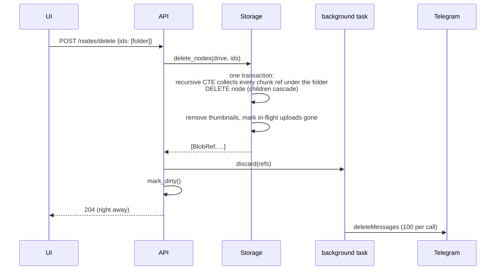

## Changing a password

Changing either password re-wraps one 32-byte key. No file in Telegram is
touched.

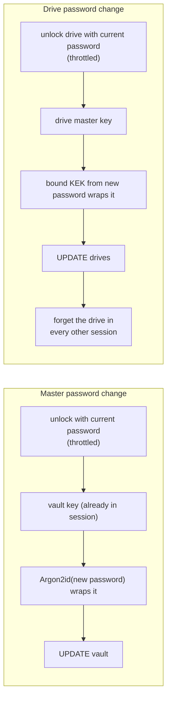

Removing a drive's password re-wraps its master key with the open-drive key
and deletes its recovery key. Adding one creates a new recovery key, shown
once.

## Thumbnails

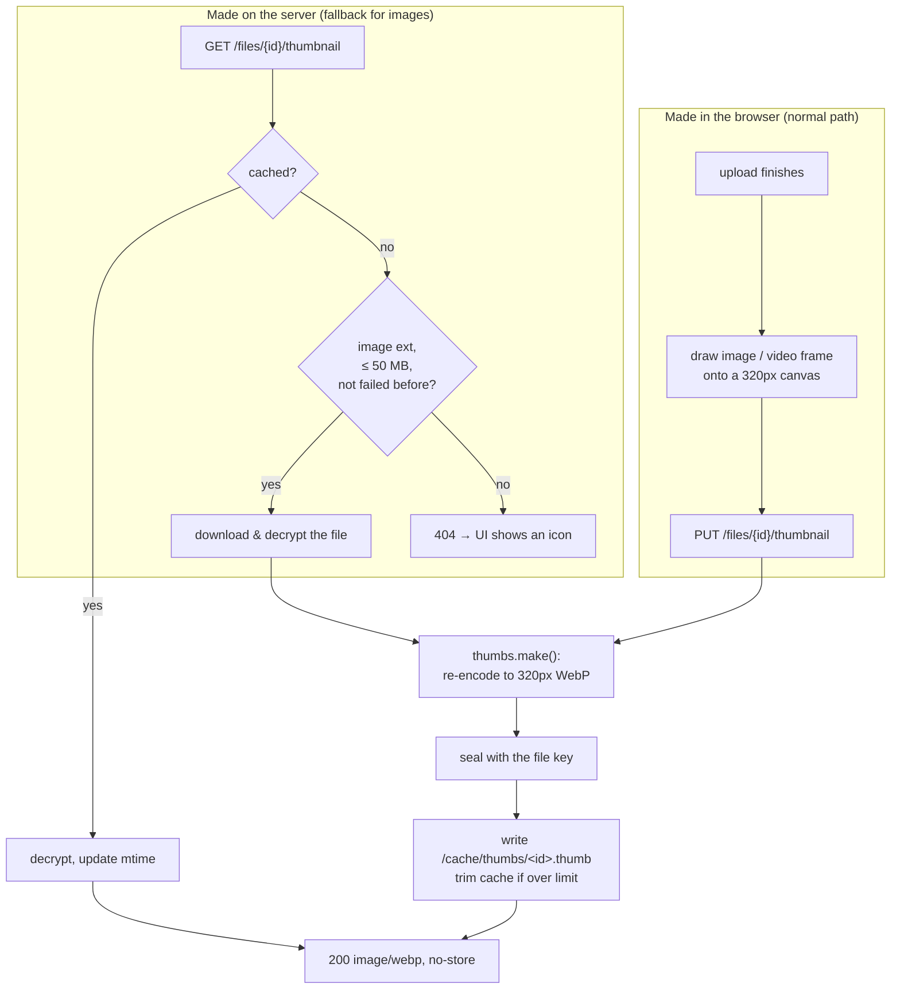

## Backup

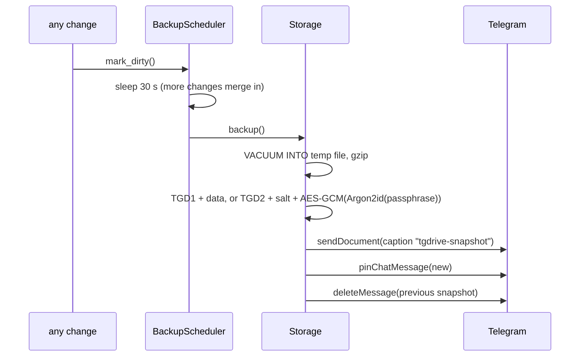

On shutdown, `BackupScheduler.stop()` uploads one final snapshot if
anything changed since the last one.

## Restoring onto a new server

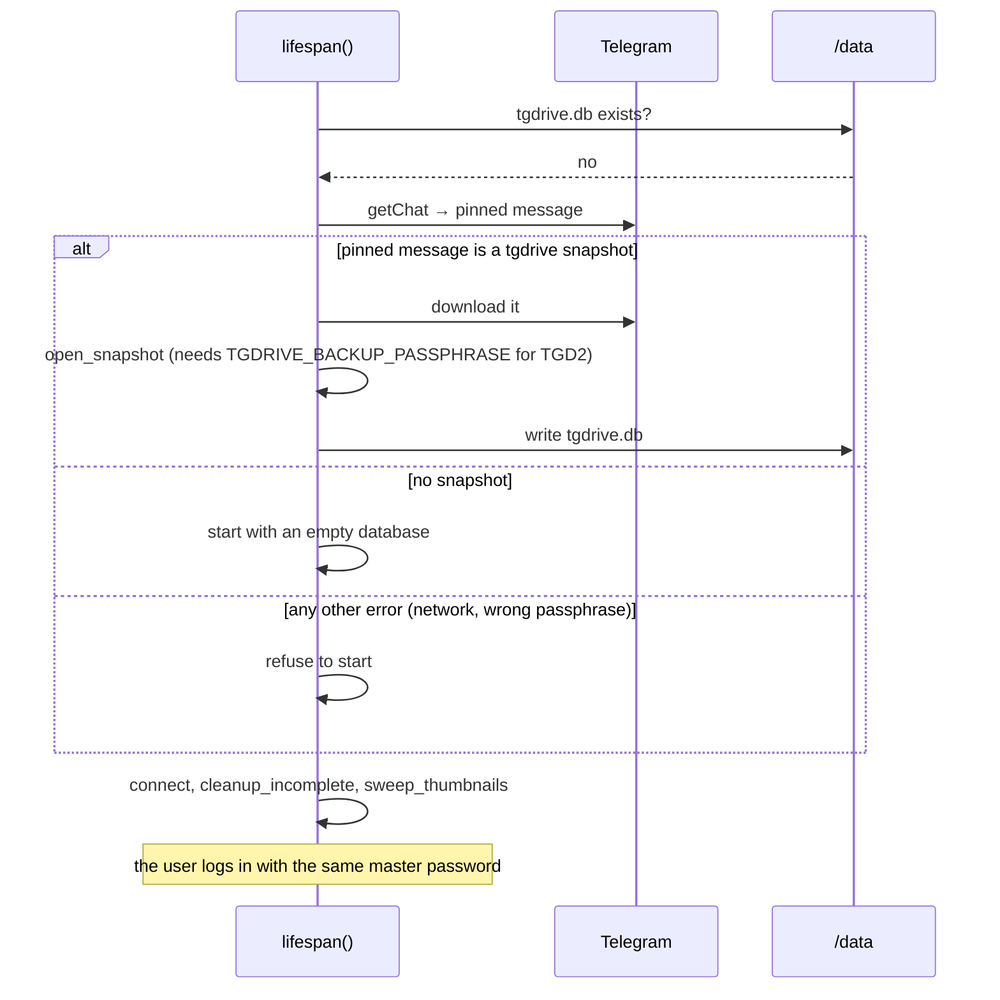

Startup refuses to continue on an unexpected restore error on purpose: a
server that started empty would, 30 seconds after its first change, pin an
empty snapshot over the good one.
