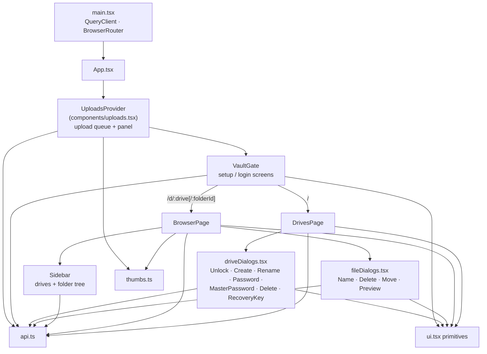
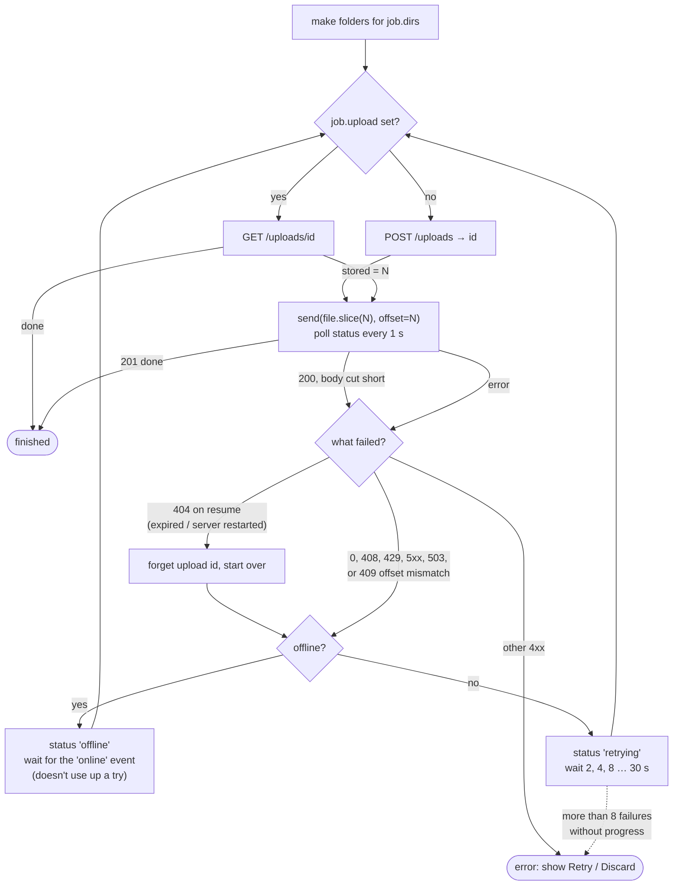

# Frontend modules

React 19 + TypeScript, built with Vite and styled with Tailwind CSS 4.
Source in [frontend/src](../frontend/src).

| Library | Used for |
|---|---|
| `@tanstack/react-query` | All server data: fetching, caching, invalidation |
| `react-router-dom` | Routes `/`, `/d/:drive`, `/d/:drive/:folderId` |
| `lucide-react` | Icons |
| `@fontsource-variable/bricolage-grotesque` | The UI font, bundled (the CSP allows no third-party origins) |

The browser never holds a key. It sends passwords to the server, gets a
session cookie back, and from then on sees only decrypted names and file
bytes that the server streams to it.

## Component tree

`UploadsProvider` sits **above** `VaultGate` and the router, so uploads keep
running while you move between folders and drives.

## React Query keys

Every server read goes through React Query. Keys are arranged so one
invalidation refreshes everything affected:

| Key | Data | Invalidated / removed when |
|---|---|---|
| `["vault"]` | `GET /vault` (set up? unlocked?) | Login, logout, and any response saying `locked: "vault"` |
| `["drives"]` | `GET /drives` | Drives created, renamed, deleted, locked, password changed |
| `["nodes", drive, parent]` | One folder listing | Any change in that drive (`["nodes", drive]` prefix) |
| `["nodes", drive, "search", q]` | Search results | Same prefix, so results refresh with the folder |

Queries do not retry 4xx answers (a locked drive won't unlock itself) and
are fresh for 5 s.

When the vault is locked (logout, idle timeout, server restart), every
query except `["vault"]` is removed, so nothing decrypted stays in memory.
Locking or leaving one drive removes `["nodes", drive]` and its thumbnails.

---

## main.tsx and App.tsx

`main.tsx` creates the `QueryClient`, registers the vault-locked handler
(`setVaultLockedHandler` → invalidate `["vault"]`), and renders. `App.tsx`
declares the routes; unknown paths redirect to `/`.

## api.ts

The typed client. `request()` wraps `fetch` for JSON calls and turns every
failure into an `ApiError` with:

- `status`: the HTTP status, `0` for "can't reach the server", `-1` for
  "cancelled by the user".
- `locked`: `"vault"`, `"drive"` or `null`, from the 401 body.
- `message`: the server's `detail`, capitalised, or a fallback.

Any response with `locked: "vault"` also fires the vault-locked handler, so
an expired session anywhere sends the app back to the login screen.

`api` has one method per endpoint. `fileUrl` and `thumbnailUrl` build URLs
for `<a href>`, ``, `<video>` and `fetch`, which carry the cookie
automatically.

`sendUpload()` uses `XMLHttpRequest` rather than `fetch`, because only XHR
reports upload progress. It returns the promise and an `abort()` function.

## components/VaultGate.tsx

Nothing below it renders until the vault is unlocked. It reads `["vault"]`
and shows one of:

- **SetupScreen** (not initialized): choose the master password, plus the
  admin password if the server requires one. Then shows the recovery key
  once in `RecoveryKeyDialog`.
- **LoginScreen** (locked): master password, or switch to "Forgot the
  master password?" to reset it with the recovery key.
- the app (unlocked).

`useLockEverything()` logs out, drops decrypted thumbnails, removes all
cached queries and refetches the vault status.

## components/uploads.tsx

The upload queue, its retry logic, and the floating progress panel. The
most involved part of the frontend.

**Input.** `pickedFromInput()` handles the file and folder pickers (folder
paths come from `webkitRelativePath`). `readDropped()` walks dropped
folders with the File System Entries API (`webkitGetAsEntry`,
`readEntries` in batches) and returns files with their folder path, plus
empty folders.

**Queue.** `enqueue(drive, parent, files, emptyFolders)` adds one `Job` per
file or empty folder. All jobs from one drop share a `Batch`, whose
`folders` map caches the id of each folder created, so a 1,000-file drop
creates each folder once (`createFolder(..., exist_ok=true)`).

**One file at a time.** `pump()` runs the next job only when none is
running. Telegram rate-limits bots per chat, so parallel uploads would
trade speed for retries.

**Resume and retry.** `run(job)` loops:

The failure counter resets whenever `stored` has moved forward, so a long
upload over a flaky connection keeps going as long as it makes progress.

**Progress.** The bar shows two layers: bytes the browser has **sent**
(light) and bytes **stored** in Telegram (solid), from polling
`GET /uploads/{id}` once a second. Speed is a moving average: 5 s while
sending, 20 s while the server is storing (it moves 16 MiB at a time).
When the server reports a `wait`, the row says why ("Telegram asked to slow
down. Trying again in 12 s.").

**After an upload**, `sendThumbnail()` makes a thumbnail from the local
copy in the background while the next file starts.

While anything is active, a `beforeunload` handler asks before the tab is
closed. Failed jobs are kept so **Retry** resumes from where they stopped;
**Discard** cancels the upload on the server, freeing its name.

## thumbs.ts

**Loading.** `loadThumbnail(drive, id)` fetches
`/files/{id}/thumbnail`, turns it into an object URL, and caches it in a
`Map` for this tab only (the server sends `no-store`, so decrypted
thumbnails never reach the disk cache). At most 3 requests run at once,
leaving browser connections free for navigation. A 404 is remembered as
"no thumbnail"; other failures are retried later. `forgetThumbnails(drive?)`
revokes the URLs.

`hasThumbnail(entry)` says whether asking can succeed: the server says it
has one, or it is an image of 50 MB or less (which the server can make on
demand).

**Making.** After an upload, `sendThumbnail()` draws an image, or a video
frame about 10% in (at most 30 s), onto a canvas scaled to 320 px and
`PUT`s it as WebP (PNG where WebP encoding is unsupported). The server
re-encodes whatever it receives. This means Telegram is never asked for a
file just to thumbnail it. `sendFrame()` does the same from a video being
watched, for videos uploaded before thumbnails existed.

## format.ts

Formatting and shared constants: `formatSize`, `formatDate`,
`formatDuration`, `previewKind(name)` (image, video, audio, pdf, text or
none, by extension), `PASSWORD_MIN = 8`, `DRIVE_NAME` (same pattern as the
server), and `driveUrl(drive, folderId)`.

## pages/DrivesPage.tsx

The home page: every drive as a list or grid, with a lock dial showing
whether it is unlocked. Opening a locked drive shows `UnlockDialog`.
A drive's menu offers lock, rename, add/change/remove password, and delete.
The page header offers create drive, change master password and lock
everything.

If `BrowserPage` finds its drive locked (session idle, locked elsewhere), it
navigates here with `state: { unlock, from }`. The page opens the unlock
dialog straight away and returns to the folder afterwards.

## pages/BrowserPage.tsx

The file browser for one drive and folder.

- **Listing**: `["nodes", drive, parent]`, as a list or grid (remembered in
  `localStorage`), with thumbnails, breadcrumbs, and the `Sidebar`.
- **Search**: the query lives in the URL (`?q=`), debounced by 250 ms, so
  Back returns to the results. Results replace the folder listing and show
  each match's folder path. `/` focuses the box.
- **Selection**: click with Ctrl/Cmd to toggle, Shift for a range; once
  anything is selected, plain clicks select too. Ctrl/Cmd+A selects all,
  Esc clears, Delete/Backspace deletes, F2 renames.
- **Actions**: new folder, upload files, upload folder, rename, move (one or
  many), delete (one or many), download, preview, lock drive.
- **Drag and drop**: files and folders dropped anywhere on the page go to
  `uploads.enqueue` for the current folder.
- **Opening**: folders navigate; previewable files open `PreviewDialog`;
  others download.

## components/Sidebar.tsx

Lists every drive, with the folder tree of unlocked drives. Folders load
lazily (`["nodes", drive, id]`, only when expanded), sharing the cache with
the main listing. It expands itself down to the folder being viewed.
Clicking a locked drive goes to the drives page to unlock it.

## components/driveDialogs.tsx

| Component | Does |
|---|---|
| `NewPasswordFields`, `checkNewPassword` | Password + repeat, minimum length |
| `UnlockDialog` | Drive password, or reset with the drive's recovery key |
| `CreateDriveDialog` | Name, and optionally a password |
| `RenameDriveDialog` | Renames the drive; the page that opened it then re-points queued uploads with `uploads.renameDrive` |
| `RecoveryKeyDialog` | Shows a recovery key once, with copy, and requires confirming it was saved |
| `DrivePasswordDialog` | Add, change or remove a drive password |
| `MasterPasswordDialog` | Change the master password |
| `DeleteDriveDialog` | Type the drive's password (or the master password) to delete it |

## components/fileDialogs.tsx

| Component | Does |
|---|---|
| `NameDialog` | New folder / rename |
| `DeleteNodeDialog` | Confirms deleting one or many entries |
| `MoveDialog` | Folder picker to move entries into |
| `PreviewDialog` | Image, video, audio, PDF (iframe) or text. Uses `?inline=true`, which the server honours only for safe types. Text previews fetch the first 512 KB with a `Range` request |

## components/ui.tsx and LockDial.tsx

Small shared pieces: `Button`, `Field`, `ErrorNote`, `Dialog` (native
`<dialog>`), `Menu`/`MenuItem`, `PageHeader`, `ViewToggle` and
`useSavedView`, and `useSubmit()` (busy and error state for a form action).
`LockDial` is the combination-lock icon whose knob turns when a drive is
unlocked.

## index.css

Tailwind entry point plus the colour tokens (`--paper`, `--surface`,
`--ink`, `--muted`, `--line`, `--teal`, `--brass`, `--danger`) used across
the components, with a second set for dark mode.
